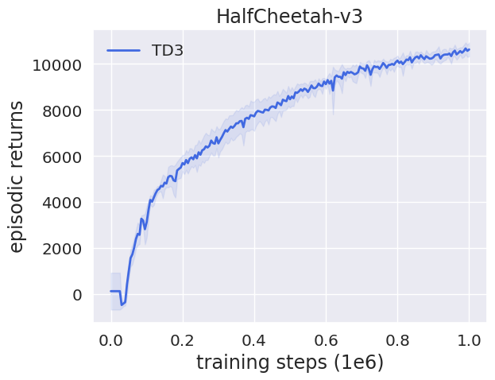
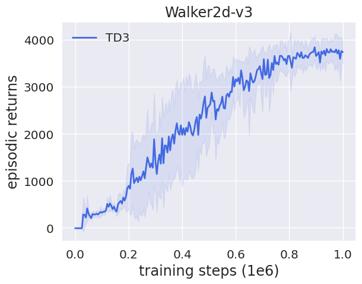
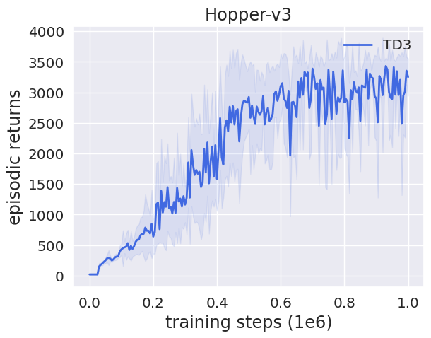
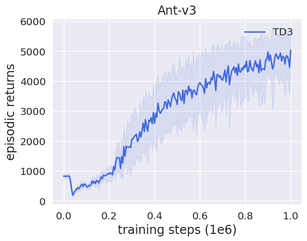

# JAX Implementation of TD3

[JAX](https://github.com/google/jax) implementation of Twin Delayed Deep Deterministic Policy Gradients (TD3) [paper](https://arxiv.org/abs/1802.09477).

This code attempts to turn the PyTorch implementation from the [original TD3 repository](https://github.com/sfujim/TD3) into JAX implementation while making minimal modifications. Training runs about two times as fast as the original PyTorch code on a i7-6700K+GTX-1080 machine.

## Requirements

- Python 3.10+
- [uv](https://github.com/astral-sh/uv) for Python package management
- [just](https://github.com/casey/just) for task automation 

## Setup

1. Install uv and just:
```bash
# Install uv
curl -LsSf https://astral.sh/uv/install.sh | sh

# Install just (on macOS)
brew install just
# Or on Linux
cargo install just
```

2. Install dependencies:
```bash
just install
```

## Usage

Run all experiments:
```bash
just experiments
```

## Development

Run tests:
```bash
just test
```

Run linting:
```bash
just lint
```

## Example Plots

<p float="left">
  
   
  
  
</p>